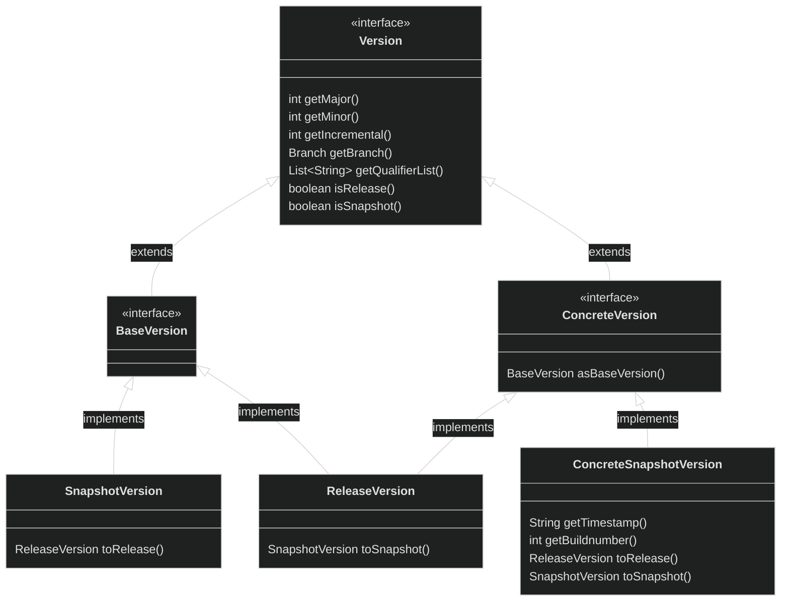

[](https://codecov.io/gh/sitepark/versioning)
[](https://snyk.io/test/github/sitepark/versioning)

# Sitepark Versioning

Sitepark Versioning is a library, that provides reusable `Version` and `VersionsSpecification` classes and utilities.

## Requirements

- Java 21 or higher

## Installing

Simply add this [maven](https://maven.apache.org/) dependency:
```xml
	<dependency>
		<groupId>com.sitepark</groupId>
		<artifactId>versioning</artifactId>
		<version>3.0.0-SNAPSHOT</version>
	</dependency>
```

## Features

### Version

`Version` is the supertype of all version classes.  To further specify _which_ version(s) are used the following subclasses are available:

| class                     | description                                                                  |
| :------------------------ | :--------------------------------------------------------------------------- |
| `Version`                 | __Any__ version                                                              |
| `BaseVersion`             | A general purpose version for external usage                                 |
| `ConcreteVersion`         | A unique version. Usually an implementation detail                           |
| `ReleaseVersion`          | A released version                                                           |
| `SnapshotVersion`         | A rolling unreleased version. Can be the superset of many `ConcreteVersion`s |
| `ConcreteSnapshotVersion` | A unique unreleased version                                                  |



#### Ordering

Version comparisons are carried out in the following order of precedence until one is unequal:
1. `major` - Higher major versions are considered greater.
2. `minor` - Higher minor versions are considered greater.
3. `incremental` - Higher incremental versions are considered greater.
4. `branch` - Versions with a `Branch.DEVELOP` are considered greater, others are compared lexicographically.
5. `snapshot status` - Release versions are considered greater than snapshot versions.
6. `qualifiers` - Qualifiers are compared lexicographically (in order).  A version with fewer qualifiers is considered greater.
7. `concrete snapshot timestamp` - If both Versions are ConcreteSnapshotVersions their `timestamp`s are compared _lexicographically_ (**not numerically!**  The result for the expected format `yyyyMMdd.HHmmss` is the same, but this is not enforced)
8. `concrete snapshot buildnumber` - If both Versions are ConcreteSnapshotVersions the one with the higher `buildnumber` is considered greater.

This concludes the following statements:
```
1.0.0 > 1.1.0
1.1.0 > 1.1.1
1.1.1 > 1.1.1-SNAPSHOT
1.1.1-SNAPSHOT > 1.1.1-feature
1.1.1-feature > 1.1.1-feature-SNAPSHOT
1.1.1-feature-SNAPSHOT == 1.1.1-feature-20230101.010000-1
1.1.1-feature-20230101.010000-1 > 1.1.1-feature-20230102.100000-1
1.1.1-feature-20230102.100000-1 > 1.1.1-feature-20230102.100000-2
```

### VersionParser

The `VersionParser` is a usefull tool to parse a `Version` into a `String`.  For most cases a unconfigured instance is sufficient, hence one is available via `VersionParser.DEFAULT_PARSER`.  
Otherwise it can be configured with `VersionParser.Characteristics` with these values:
```java
final VersionParser parser = new VersionParser(

		// do not set branches (they default to Branch.DEVELOP)
		VersionParser.Characteristics.IGNORE_BRANCHES,

		// do not set any qualifiers
		VersionParser.Characteristics.IGNORE_QUALIFIERS);
```

Generally, a `String` to be parsed into a `Version` has to follow the following format or cause a `ParseException`:
```java
"<major>.<minor>.<incremental>-<branch>-<qualifiers>"
```
`major` may be omitted if not leaving the `String` empty, defaults to zero (`0`)  
`minor` and the leading dot (`.`) may be omitted, defaults to zero (`0`)  
`incremental` and the leading dot (`.`) may be omitted, defaults to zero (`0`)  
`branch` and the leading hyphon (`-`) may be omitted if no `qualifiers` are given, defaults to `Branch.DEVELOP`  
`qualifiers` and the leading hyphon (`-`) may be ommitted

Here are some valid examples:
```java
"1.0.0-develop"
"1"
".2"
"1.3-some_feature-release_candidate-0"
"-experimental"
```

There are three types of `Versions` a `VersionParser` can be used for:

#### Releases

If we expect/require the `String`s we feed into the `VersionParser` to all represent `ReleaseVersion`s, we can use the `parseRelease` method.  This differs from the other parsing methods in such a way, that qualifiers, that would otherwise indicate the `Version` beeing a `SnapshotVersion` are not treated as such.  

For example, a `String` like `"1.0.1-SNAPSHOT"` would result in a `ReleaseVersion` with the qualifier `"SNAPSHOT"`.  Similarly `"1.0.2-20233005.1415-7"` would also return a `ReleaseVersion` with the qualifiers `"20233005.1415"` and `"7"`.

#### BaseVersions

The `parseBaseVersion` method does respect the `"-SNAPSHOT"` qualifier (if it is the last one).  This means, that a `String` ending with this postfix will result in a `SnapshotVersion` and others will produce a `ReleaseVersion`.

Here are some examples:
```java
final BaseVersion version = VersionParser.DEFAULT_PARSER
    .parseBaseVersion("1.2-SNAPSHOT");

// these work well with pattern matching!
final ReleaseVersion release = switch (version) {
    case SnapshotVersion snapshot -> snapshot.toRelease(),
    case ReleaseVersion release -> release;
};
```

#### PotentialConcreteSnapshots

The `parseConcreteVersion` method is simmilar to [BaseVersions](#BaseVersions).  If a given `String` ends with two qualifiers that match the format explained below a `ConcreteSnapshotVersion` will be constructed and a `ReleaseVersion` otherwise.

__Format__: the second to last qualifier requires eight digits, a dot and then 6 more digits.  Directly followed by a qualifier, that only consists of digits.  Or as described by a regular expression: `-\d{8}\.\d{6}-\d+$`.  
This is based on maven naming unique snapshot versions by replacing `"-SNAPSHOT"` with the build date ("Etc/UTC" timezone, `yyyyMMdd.HHmmss` format) and a build number.

```java
final ConcreteVersion version = VersionParser.DEFAULT_PARSER
    .parseConcreteVersion("1.2-20210129.214836-2");

// these work well with pattern matching!
final BaseVersion release = switch (version) {
    case ConcreteSnapshotVersion snapshot -> snapshot.asBaseVersion(),
    case ReleaseVersion release -> release;
};
```

### VersionFormatter

To flixibly transform `Version`s to `String`s a configurable `VersionFormatter` can be used.  
This class takes a `String` as format, which determines how `Version`s feed into it are transformed.  Such a `String` may contain the following keywords surrounded by colons (`:`):

| keyword     | description                                    |
| :---------- | :--------------------------------------------- |
| MAJOR       | the major                                      |
| MINOR       | the minor                                      |
| INCREMENTAL | the incremental                                |
| FEATURE     | the feature `Branch` (if present)              |
| SNAPSHOT    | `"SNAPSHOT"`, if the version is a snapshot     |
| TIMESTAMP   | the timestamp of a `ConcreteSnapshotVersion`   |
| BUILDNUMBER | the buildnumber of a `ConcreteSnapshotVersion` |
| QUALIFIERS  | all hyphon-separated (`-`) qualifiers (if any) |

```java
final VersionFormatter formatter = new VersionFormatter(":MAJOR:.:MINOR:.:INCREMENTAL:");
formatter.format(onePointTwo); // -> "1.2.0"
```

Keywords also may contain a prefix after the first colon (`:`), which is prepended if the resolution of the keyword is not empty:

```java
final VersionFormatter formatter = new VersionFormatter(":MAJOR:.:MINOR:.:INCREMENTAL::-BRANCH:");
formatter.format(onePointTwo); // -> "1.2.0"
formatter.format(onePointTwoFeature); // -> "1.2.0-feature"
```

To include a literal colon (`:`) two (`::`) may be used.  

For most usecases the preconfigured constants should be sufficient (which are also used by the `toString` implementations):
- `VersionFormatter.DEFAULT_BASE_VERSION_FORMATTER`
- `VersionFormatter.DEFAULT_CONCRETE_VERSION_FORMATTER`


### VersionTypes

The `VersionTypes` class can be usefull for an api to have it's user specify kinds of versions.

As an example, a `Repository` class may contain a method to query certain versions:
```java
public class Repository {

	public List<BaseVersion> queryVersions(final VersionTypes types) {
		// ...
	}

	// ...
}
```

which then can be used like this to retrieve only the desired versions:

```java
final List<BaseVersion> developReleases = repository.queryVersions(
		new VersionTypes(
				VersionTypes.PublicationStatusType.RELEASES,
				VersionTypes.BranchType.DEVELOP));

final List<BaseVersion> developSnapshots = repository.queryVersions(
		VersionTypes.ONLY_DEVELOP_SNAPSHOTS);

final List<BaseVersion> all = repository.queryVersions(VersionTypes.ALL);

final List<BaseVersion> none = repository.queryVersions(VersionTypes.NONE);
```

### VersionsSpecification

A `VersionsSpecification` defines a subset of `Version`s.  Divided into `Branch`es they contain `ExplicitVersion`s and/or `VersionRange`s.  
They can be created either manually via `VersionsSpecificationBuilder` or from `String`s with a `VersionsSpecificationParser`.  The syntax used for it is based on [Maven's VersionRange's](https://cwiki.apache.org/confluence/display/MAVENOLD/Dependency+Mediation+and+Conflict+Resolution#DependencyMediationandConflictResolution-DependencyVersionRanges):

`ExplicitVersion`s follow the same rules as for the [VersionParser](#VersionParser).  
A `VersionRange` consists of exactly one of these lower and upper `Boundary`s\* separated by a comma (`,`):  

| Name                                                                                                                               | Syntax       | Description      |
| :--------------------------------------------------------------------------------------------------------------------------------- | :----------- | :--------------- |
| [ExclusiveLowerBoundary](src/main/java/com/sitepark/versioning/version/specification/element/boundary/ExclusiveLowerBoundary.java) | (\<version\> | __x > version__  |
| [InclusiveLowerBoundary](src/main/java/com/sitepark/versioning/version/specification/element/boundary/InclusiveLowerBoundary.java) | [\<version\> | __x >= version__ |
| [UnlimitedLowerBoundary](src/main/java/com/sitepark/versioning/version/specification/element/boundary/UnlimitedLowerBoundary.java) | (            | any __x__        |
| [ExclusiveUpperBoundary](src/main/java/com/sitepark/versioning/version/specification/element/boundary/ExclusiveUpperBoundary.java) | \<version\>) | __x < version__  |
| [InclusiveUpperBoundary](src/main/java/com/sitepark/versioning/version/specification/element/boundary/InclusiveUpperBoundary.java) | \<version\>] | __x <= version__ |
| [UnlimitedUpperBoundary](src/main/java/com/sitepark/versioning/version/specification/element/boundary/UnlimitedUpperBoundary.java) | )            | any __x__        |

\* The `Boundary`s may not both be unlimited.  

Each `Version` in a `VersionsSpecification`-`String` may be written in any way the [VersionParser](#VersionParser) understands.  Spaces are ignored (except inside of `Version`s).  All `Version`s of a `VersionRange` have to define the same `Branch`.

Here are some examples for valid `VersionsSpecification`s:

| String                      | Explaination                               |
| :-------------------------- | :----------------------------------------- |
| 1.0                         | __x == 1.0.0__.                            |
| (, 1.0\]                    | __x <= 1.0.0__                             |
| \[1.2, 1.3\]                | __1.2.0 <= x <= 1.3.0__                    |
| \[1.0, 2.0)                 | __1.0.0 <= x < 2.0.0__                     |
| \[1.5, )                    | __x >= 1.5.0__                             |
| (, 1.0\], \[1.2,)           | __x <= 1.0.0 or x >= 1.2.0__               |
| (, 1.1), (1.1, )            | __x != 1.1.0__                             |
| \[1.0-feature, )            | __x >= 1.0 of the branch "feature"__       |
| \[1.0-feature, 2.0-feature) | __1.0 <= x < 2.0 of the branch "feature"__ |
| (, 1.2), 1.2-feature        | __x < 1.2.0 or 1.2.0-feature__             |

## Development

You will need:
- Java 11 or higher
- Maven 3 or higher

Check this repository out
```sh
git clone git@github.com:sitepark/versioning.git
cd versioning
```

Add or edit the code and install it
```sh
mvn install
```

Update `versioning` in the project you want to use it in
```sh
mvn package
```

And that's it!  
If you build something others could find usefull as well please consider opening a pull request.

## Contributing

We accept pull requests and respond to issues via GitHub.  There are some guidlines which will make applying PRs easier for us:
- respect the code style
- provide JUnit tests for your changes
- add javadoc comments for public classes and methods, conforming to other comments (also see [oracles bestpractices](https://www.oracle.com/ke/technical-resources/articles/java/javadoc-tool.html))
- create minimal diffs - disable on save actions like reformat source code or organize imports. If you feel the source code should be reformatted create a separate PR for this change.

The pipeline will fail if either [pmd](https://pmd.github.io/), [spotbugs](https://spotbugs.github.io/) or [checkstyle](https://checkstyle.org/) are violated, javadocs are missing or invalid or any tests fail.  To check this before commiting run `mvn verify`.

## License

This project is licensed under the [MIT License](LICENSE.md).

